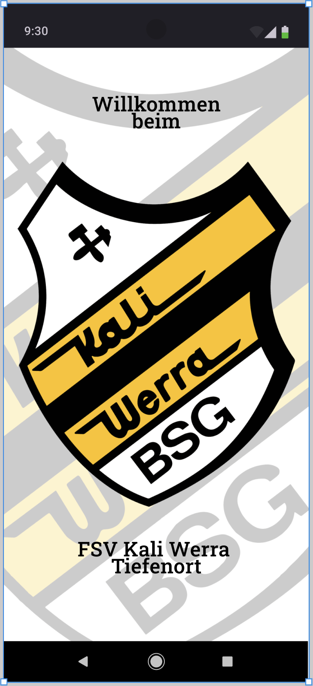
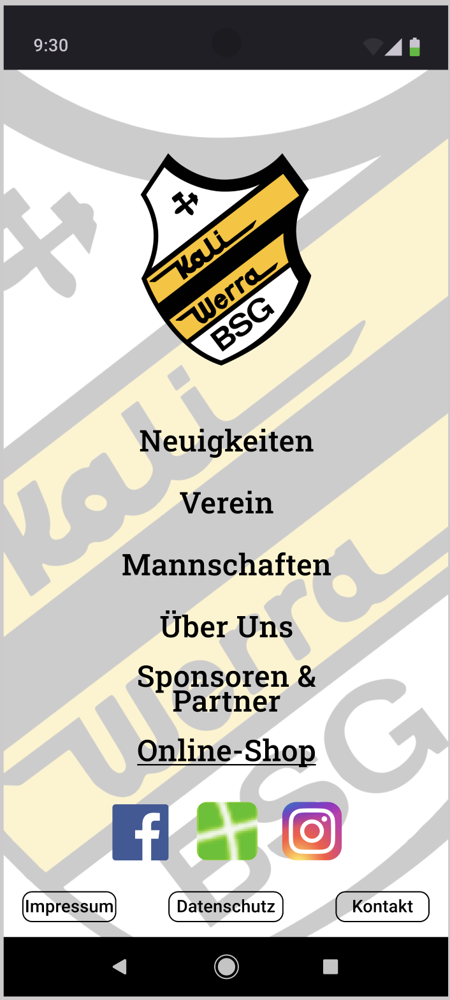
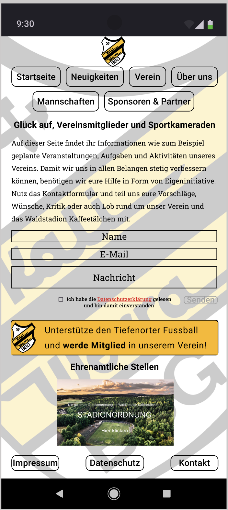
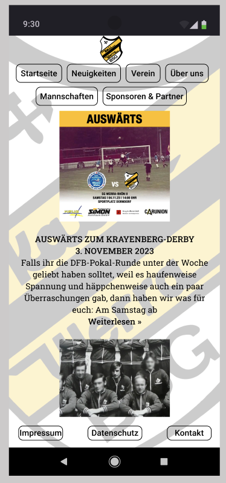
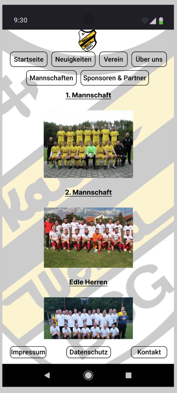
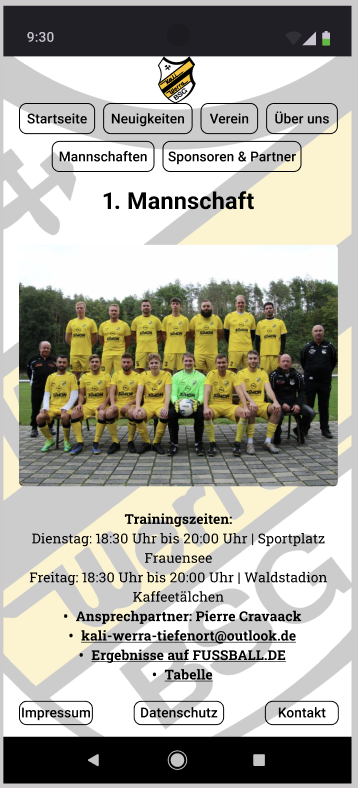
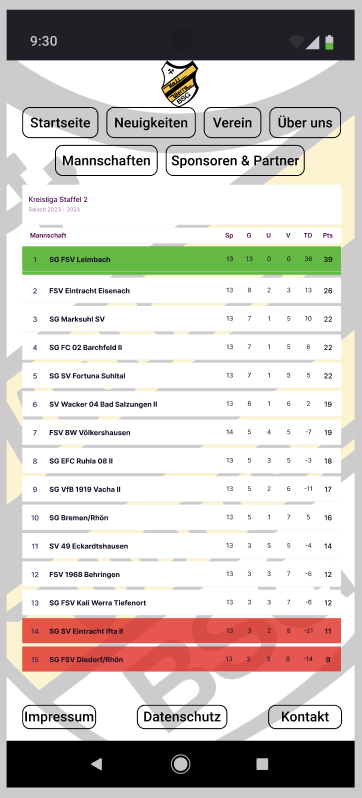
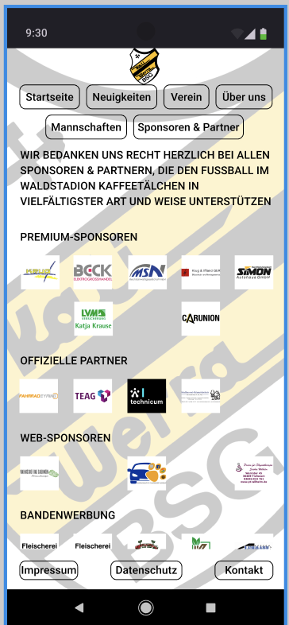
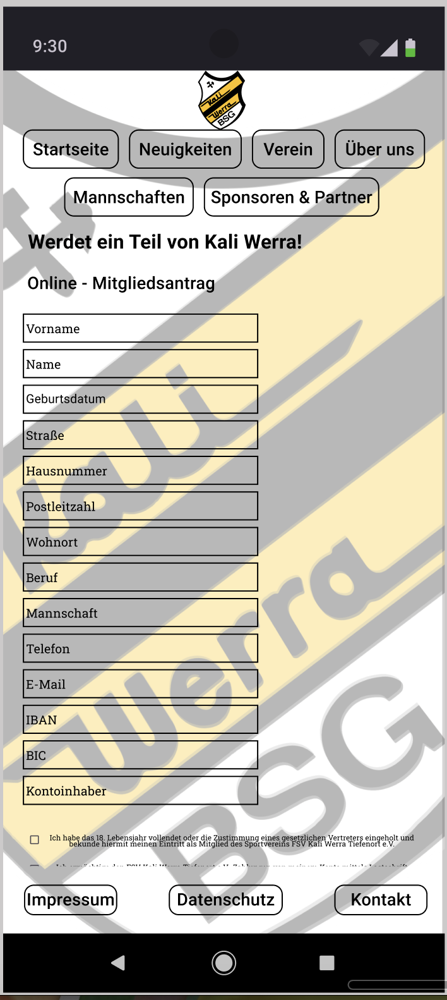

# BSG KALI WERRA TIEFENORT

**(Optional) Füge hier einen kurzen, knackigen Slogan ein, um deine App zu bewerben.**

Eine Übersicht von Informationen rund um den Verein, Mannschaften und Tabellen in einem ohne auf diverse Webseiten zu müssen

## Geplantes Design
Füge hier einige repräsentative Designs deiner App ein (z.B. aus Figma)

  
  
  
  
  
  
  
  
  

## Features
Hier kommen alle geplanten Features der App rein mit dem Status, ob es bereits umgesetzt wurde.

- [ ] MannschaftsView für die Übersicht aller Mannschaften
- [ ] MannschaftsDetailView für die Anzeige von Information einer ausgewählten Mannschaft
- [ ] eine View wo man des letzte und das kommende Ligaspiel sieht
- [ ] TabellenView: hier wird die Tabelle der ausgewählten Mannschaft angezeigt
- [ ] Über Uns: hier wird ein Historie angezeigt vom Stadionbau, und es gibt einen kleine Auswahl an Videos aus vergangener Zeit und die VereinsHymne
- [ ] Mitgliedsantrag: hier kann man einen MitgliedsAntrag stellen
- [ ] VereinsView: beinhaltet einen Messageteil der an den Verein gesendet werden kann, die Stadionordnung als Download, ein aktuelle Video, 2 Banner zur Weiterleitung zum Mitgleidsantrag und den Ehrenamtlichen Stellen
- [ ] usw.
- [ ] ...

## Technischer Aufbau

#### Projektaufbau
Projekt beinhaltet 
- Models für Clients, Struct's
- Views mit Unterordner für die jeweiligen View mit ViewModels
- Constant für "HilfsViews" und ausgelagerte Views für einen bessere Code-Übersicht

#### Datenspeicherung
Benutzerdaten, wie Registrierdatum, Username, E-Mail-Adresse und UserId in Firebase
ansonsten Datenabfrage über Firestore Database

#### API Calls
<a href="https://www.openligadb.de"> openligadb.de</a>

#### 3rd-Party Frameworks
- Firebase
- MessagUI

## Ausblick
Chatfunktion für Trainer und Vorstand
weitere Anmelde- / Registriermöglichkeiten z.B. über Apple, Google

## Special Thanks

Ich bedanke mich bei meinem Dozenten Leonid Riedel, bei den Tutoren Brain Moyou, Laurenz Meies und Max Krass für ihre Hilfe.
Desweiteren bedanke ich mich ebenfalls bei allen Dozenten und Tutoren, die mich das vergangen Jahr begleitet und mir das Wissen über App - Entwicklung vermittelt haben.
Besondern Dank gilt aber zwei wunderbaren Menschen die mir ans Herz gewachsen sind und ich als Freunde bezeichnen kann. Juri Huhn und Eike Matthias Engelmann.
Diese Beiden haben mich oft in den Hintern getreten und mich zum Weitermachen des Kurses bewegt. Danke Jungs!!!
 
